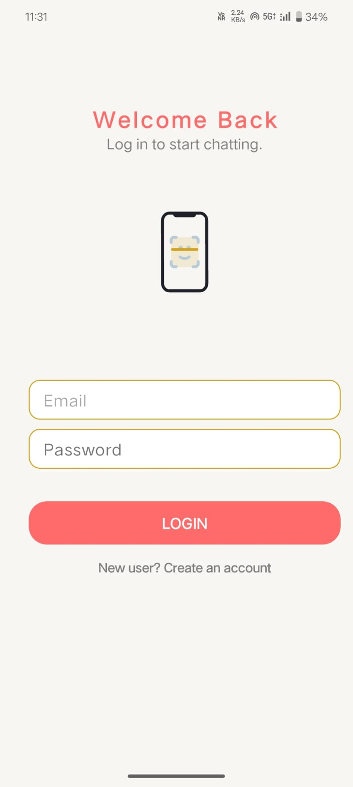
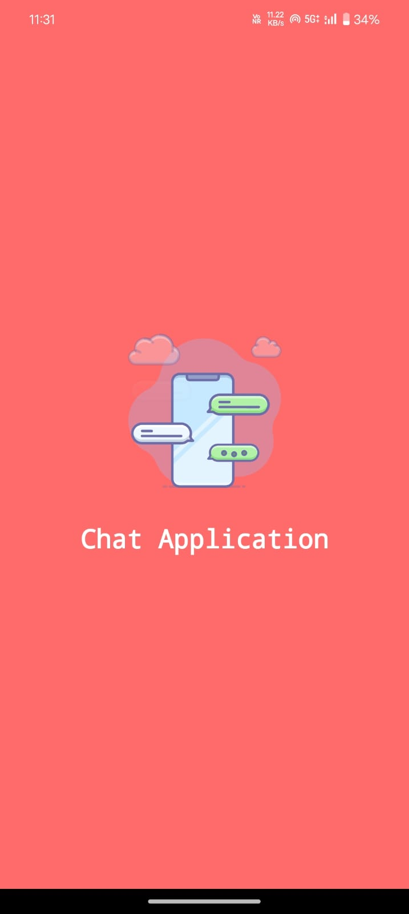
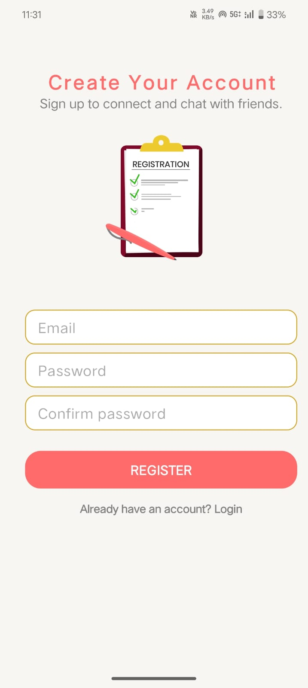
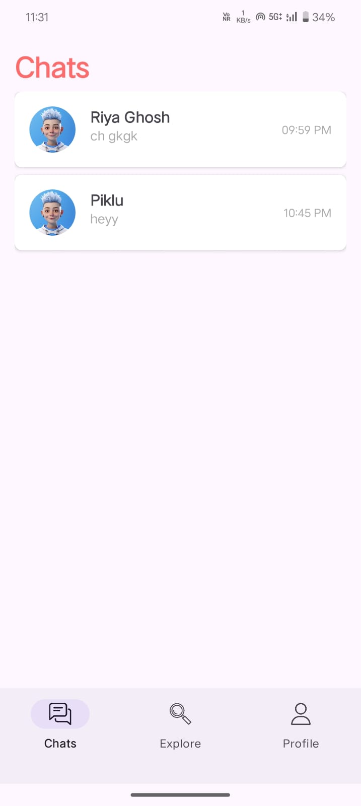
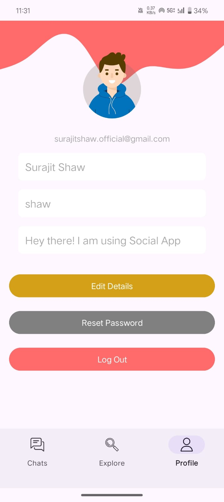

# Chat App in Kotlin

I’m so excited to share my very first Android project—a chat app built in Kotlin! This app includes:

- 🔐 **User Login** with Firebase Authentication
- 💬 **Real-Time Messaging** using Firebase Firestore
- 🧭 **Smooth Navigation** with a Bottom Tab Bar
- 💾 **User Settings** saved with Shared Preferences
- ✨ **View Binding** for clean and easy-to-read code

This project has been an amazing way to start learning Android development.

## Screenshots of the App

Here’s a glimpse of the app’s interface across various screens:

### **Login and Splash Screens**
| **Login Screen** | **Splash Screen** | **Register Screen** |
|------------------|-------------------|---------------------|
|  |  |  |

### **Chats, Profile, and Explore Screens**
| **Chats Screen** | **Profile Screen** | **Explore Screen** |
|------------------|--------------------|--------------------|
|  |  |  |

## Features

- **User Login**: Firebase Authentication provides a secure login experience.
- **Real-Time Messaging**: Firebase Firestore allows for seamless real-time communication.
- **Bottom Navigation**: A smooth and intuitive bottom tab navigation for easy app navigation.
- **Shared Preferences**: User preferences are saved and accessed with Shared Preferences.
- **View Binding**: Easy-to-read code with the use of View Binding for better UI handling.

